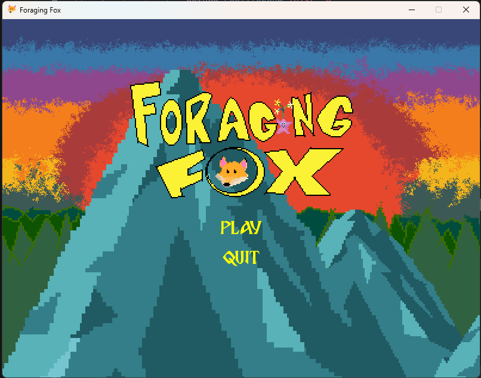

# Foraging Fox

A minesweeper clone where you are a fox foraging the mountain growth for the fabeled Star Root. This is our first game jam we've ever done, and the first game we've ever made together. We learned a lot this game jam.



## Development Team - Wacky Glass Factory

| Member | Social | Role |
| ------ | ------ | ---- |
| Levi (aka digitalbinary) | @levi:rooksoft.net | Programmer |
| Matt | KentuckyFriedRice | Art Director |
| Noah | [bluesky](https://bsky.app/profile/holdingforever.bsky.social) | Music & Sound Design |

## Install Guide

If you don't want to download the `.exe` from the github releases, you can setup the project by following the steps below. This assumes that you have [uv](https://docs.astral.sh/uv/) installed and some familiarity with Python.

1. Clone the repo

```bash
git clone git@github.com:The-Ranger22/foraging-fox.git
```

2. Setup the virtual environment

```bash
uv venv && uv pip install -r pyproject.toml
```

3. Activate the environment 

```bash
# Linux
source .venv/bin/activate

# Windows
.venv\Scripts\activate.bat
```

4. Run the game!

```bash
python -m src
```


## Disclosure

### Art Assets Used

| Art | Source |
|-----| ------ |
| Main Screen Background | [link](https://life-in-pixels.itch.io/free-3-mountains-backgrounds-380x180-and-1920x1080) |


